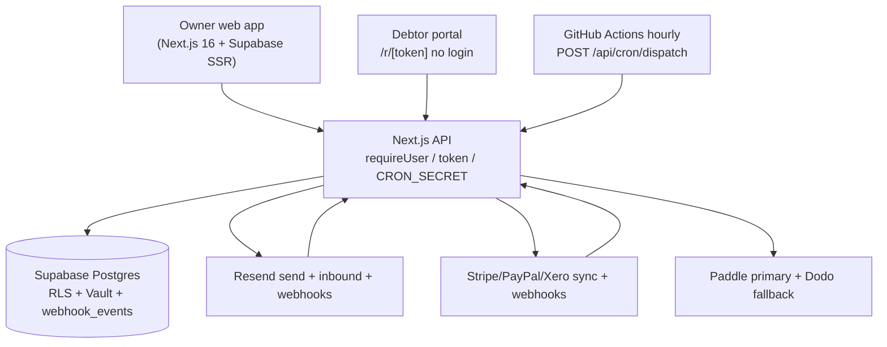

# Overdue — Detailed HLD (codebase-accurate, 2026-09-23)

Covers every segment: pages, APIs, lib, DB 0001–0024, workers, providers, UI.

## 1. System context

Actors: Business owner (workspace owner/admin/member/viewer), Debtor (no login, HMAC token), Providers (Stripe/PayPal/Xero/Paddle/Dodo/Resend).

Deployment: Vercel (`vercel.json` crons empty), GitHub `dispatch.yml` hourly `DISPATCH_URL + CRON_SECRET`, Supabase project `zuctxglrrijcvtcwckks`, `supabase db push` 0001–0024 in sync, `assert-write-boundary 0 problems`.

## 2. Frontend segments (`src/app/**`, `src/components/**`)

### 2.1 Public pages (no auth)
`/` marketing (ReceiptTicker, EscalationLadder, ProPrice), `/pricing`, `/templates`, `/templates/[slug]`, `/security`, `/refund`, `/terms`, `/privacy`, `/signup`+`/login` (AuthForm), `/auth/callback` (PKCE), `/r/[token]` debtor portal (verifyResolutionToken → offer+invoice+profile → ResolutionView; best-effort viewed_at).

### 2.2 Authenticated `(app)` shell (`layout.tsx`: getSessionUser else redirect, AppTopBar+AppDock)
- `/dashboard`: getAgingTotals, getUrgencyQueue(15), getProfile, getRecoveryQueue(5), getClientOptions, countForUser, getIntegrations → AddInvoiceButton, ConnectSourcesDialog, AgingStrip, SettlementStrip, RecoveryQueue, UrgencyQueue.
- `/invoices?focus=`: getInvoicesWithMeta, getClientOptions, getPlan + focus getReplyThread/getOpenDisputes → InvoiceTable (filter all/open/overdue/due-soon/paid; Pause/Resume/Mark-paid via PATCH invoices/[id]), ReplyThread.
- `/invoices/[invoiceId]`: getInvoiceDetail (invoice+client+runs+messages+replies+disputes+offers) → overview Card, RecoveryTimeline (buildInvoiceTimeline), InvoiceRecoveryFlow (SettlementCard + Review-email modal → POST invoices/[id]/send), ReplyThread, message history.
- `/clients`: computeClientPaymentScores + getClientHealthRows → ScoreBar/HealthChip.
- `/sequences`, `/sequences/new` (createBlank/createFromTemplate, free limit 1), `/sequences/[id]` (SequenceEditor → PUT/DELETE /api/sequences; EscalationLadder rungs).
- `/settings`: getProfile → SenderNameForm (PATCH account/sender), AccountDataControls (GET export / DELETE delete), links to integrations/billing.
- `/settings/billing`: reconcilePaddle||Dodo + getSubscriptionsForUser + portal URLs → PlanManager (Paddle checkout → Dodo fallback, overlay-error telemetry).
- `/settings/integrations`: integrations select → IntegrationsManager (sync/disconnect, PayPal save, CSV import, Smart-CSV link).
- `/insights`: computeClientPaymentScores, getUrgencyQueue(100), getInsights, getRecoveryQueue(100) → DSO/aging/forecast/risk/behavior cards.
- `/tools`, `/tools/[slug]` (AppToolDetail browser math), `/tools/smart-csv` (SmartCsvImporter → map/insights APIs → integrations/csv).
- `/onboarding` wizard (identity→invoice→schedule→preview→done; POST /api/invoices, profiles update, localStorage resume).

### 2.3 Component inventory
Ledger: InvoiceTable, InvoiceRecoveryFlow, RecoveryTimeline, RecoveryQueue, UrgencyQueue, EscalationLadder+TonePill, RecoverySteps, AgingStrip, ReceiptTicker, ReplyThread, AddClientButton, AddInvoiceButton, SequenceEditor. Settlements: SettlementCard (recommend→approve), SettlementStrip (RSC live offers + promise due/broken), ResolutionView+PayButton (accept/promise/plan-request with P/frequency/start + disclosure/dispute/withdraw). Shell: AppTopBar, AppDock, PageHeader. Billing: ProPrice, PlanManager. Settings: SenderNameForm, IntegrationsManager, ConnectSourcesDialog, AccountDataControls. Calculators: AppToolDetail, RealtimeCalculator, SmartCsvImporter. Marketing: site, LandingToolTeaser, CopyEmailButton. Auth/UI: AuthForm, AuthNotice, AuthCodeHandler, Button/Card/Badge/Input/Select/Switch/EmptyState, ErrorLedger.

## 3. Backend API segments (`src/app/api/**`, 41 routes)

- Plans: `POST /api/plans` (owner proposal via algorithm, suspends settlement, versioned installments, workflow+outbox), `PATCH /api/plans/[id]` (debtor_accept→active+converted / debtor_decline→cancelled+under_review / owner_cancel).
- Requests: `PATCH /api/plan-requests/[id]` owner-only decline|cancel (closed + resume +24h + resume suspended→sent + workflow+outbox). Debtor withdraw is token route.
- Disputes: `PATCH /api/disputes/[id]` outcome resolved|withdrawn|credit_issued|invoice_corrected (+outcome column 0024; resume +24h or cancel chase).
- Payments: `POST /api/payments/manual` (ledger insert, confirm=true, dual-control >50000c, manual_payment_approvals + workflow).
- Portal: `POST /api/portal/renew` (sha256 hashed 30d session, fresh_link/plan_portal).
- Public: `POST /api/r/[token]/resolve` (accept/promise ≤60d/plan_request P/frequency/start +2-per-30d +72h +suspend/dispute/withdraw; pauses ladder), `POST /api/r/[token]/pay` (fail-closed 409 no_payment_url, never returns invoice.payment_url).
- Invoices: `POST /api/invoices` (client lookup/insert, free caps, attachDefaultRuns), `PATCH /api/invoices/[id]` (payment_url/pause/resume/mark_paid + reconcilePaidWork), `POST .../sequence` (startRun), `POST .../send` (confirmed → sendRunNow email).
- Settlements: `POST .../recommend` (read-only EV), `POST .../approve` (validates offer≤outstanding, incentive≤2000bps, expiry≤14d; cancels superseded; signs token link).
- Clients/sequences: CRUD + free limits + template clone + activate attaches runs.
- Cron: `POST /api/cron/dispatch` (Bearer CRON_SECRET → runDispatcher; 500 on ok:false).
- Webhooks: stripe (invoice.paid), paddle/dodo (subscription lifecycle, 200-unresolved stops retry), paypal (INVOICING.INVOICE.PAID), xero (fetch-then-flip PAID only), email inbound (classify→reply_intel/disputes/runs pause), resend (opened/delivered/bounce→runs.failed). All signature-verified + webhook_events idempotent.
- Billing/integrations/account/tools/AI/health: status diagnostics, paddle/dodo checkout, stripe/xero OAuth start/callback + Pro gate + syncUserProvider, paypal save, CSV import (10MB, free caps), [provider] sync/disconnect, sender/export/delete (Paddle+Dodo cancel first), ai/draft (quota), smart-csv map/insights (LLM + heuristic fallback), health probe.

## 4. Domain services (`src/lib/**`)

- `recovery/payment-plan.ts`: periodDays 7/14/31-conservative, countThatFits=floor(Dmax/period)+1, allowed=min(Cmax,that), splitEvenly, buildInstallments precedence (desired>allowed floor-check shrink→no_plan; final<M→counter n-1; else honor P), counterReason enum, lastDueDateExceedsDmax calendar check, buildDueDates anchor_day.
- `recovery/money-rules.ts`: canCreateSettlement (null/completed/cancelled only), canActivatePlan (paid/expired/cancelled only), requiresDualControl/dualControlPasses, dedupeKey, isValidDisputeOutcome, directPaymentOfferEndState (suspended→cancelled).
- `recovery/paid.ts`: reconcilePaidWork — runs cancelled, disputes resolved, live offers→paid / suspended→cancelled(superseded_by_direct_payment), requests closed/invoice_paid_directly, plans completed/direct_invoice_payment + installments cancelled, workflow invoice_paid.
- `recovery/settlement.ts`: EV math (basePayToday/Wait, lift curve, recommendSettlement grid ≤maxBps).
- `recovery/token.ts`: HMAC offerId.expiryMs.sig (sig-only verify; DB expiry enforced).
- `scheduler/dispatch.ts`: runDispatcher (claim queued→processing, Pro gate, low-confidence pause, dispatchOne), dispatchOne (ownership guard, inactive pause, resolution URL attach, paid→completed, promise future-hold / past→promise_missed + workflow + resume +24h, replied pause, dispute/plan gates + stale-request expiry, draftEmail, write-ahead sending→sent/failed, advanceLadder + offer approved→sent), startRun (catch-up step, D07 no-clobber, D08 one-active), mapReplyToRunAction, handleInboundReply (thread-first, pause all, reply_intel, dispute insert, promise upgrade to queued), sendRunNow, attachDefaultRuns.
- `integrations/*`: stripe/paypal/xero sync→InboundInvoice, sync.ts withRefreshMutex + upsert + attach runs, paid-webhooks verify+markInvoicePaid+resolveOwner-alreadyHandled/recordEvent, oauth sign/verify state, credentials Vault wrappers, csv parse, provider upsert, stripe-flag.
- `billing/*`: plan/countForUser, entitlement grace, paddle/dodo events + reconcile (email→customer→subscription pick + upsert), limits (3 clients/1 ladder/10 invoices/5 AI).
- `resend/send.ts`: sendEmail + renderEscalationEmail (resolution button).
- `supabase/*`: SSR/browser/admin/middleware/session + getOwnedRecord(id+user_id guard).
- `ai/*`: draft (quota ai_usage), providers fallback, reply classify, promise detect.
- `db/queries.ts`: aging/urgency/scores/sequences/invoices/recoveryQueue/buckets/health/forecast/insights/replyThread/openDisputes/invoiceDetail.
- `onboarding/*`: schedule offsets/preview, timeline builder.
- `utils/*`: format/date/money, rate-limit (Upstash), receipt-ticker demo.

## 5. Data-flow highlights

Reminder: cron→claim→Pro/confidence gates→promise/dispute/plan gates→draft→write-ahead sending→Resend→sent→advance (current_step=rung, next_run_at cumulative). Resolve link rides along (approved→sent). Promise: token/inbound → runs queued+promise_date → hold → miss→promise_missed + resume +24h. Plan: debtor request (suspend offer, pause) → owner proposal (versioned installments) → debtor accept (active+converted) / decline (cancelled+under_review). Dispute: open→pause → owner outcome → resume +24h or cancel. Paid: invoice flip → reconcile all (runs/disputes/offers/requests/plans/workflow). Manual: confirm + dual-control → payments + approvals + workflow. Portal: renew hashed session → fresh link.

## 6. Cross-cutting

Auth: requireUser (session) for owner APIs; token HMAC for debtor; Bearer CRON_SECRET for cron; webhook signatures per provider. RLS: authenticated SELECT-only (profiles +UPDATE); writes via service_role + getOwnedRecord. Idempotency: messages (run,step) write-ahead, webhook_events(provider,event), one-open-request index, runs_one_active_per_invoice. Audit: workflow_events append-only trigger + settlement_events offer-scoped + reply_intel. Notifications: member-targeted dedupe_key + outbox_jobs (email/reminder/digest) + webhook_receipts split retry/DLQ. Time: date-only workspace tz, 09:00 reminders, 09:15 digest, 72h review, 7d proposal, 24h resume, 60d promise max, 14d settlement max.
