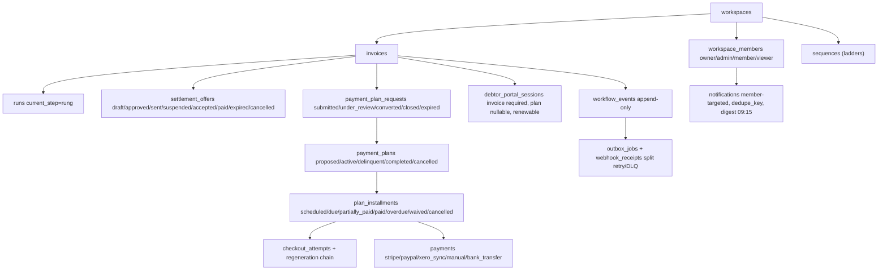
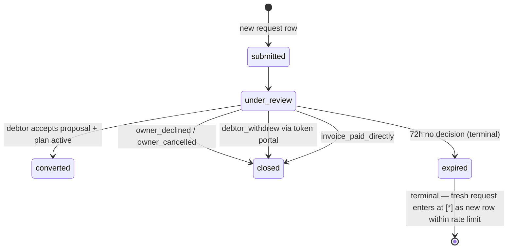
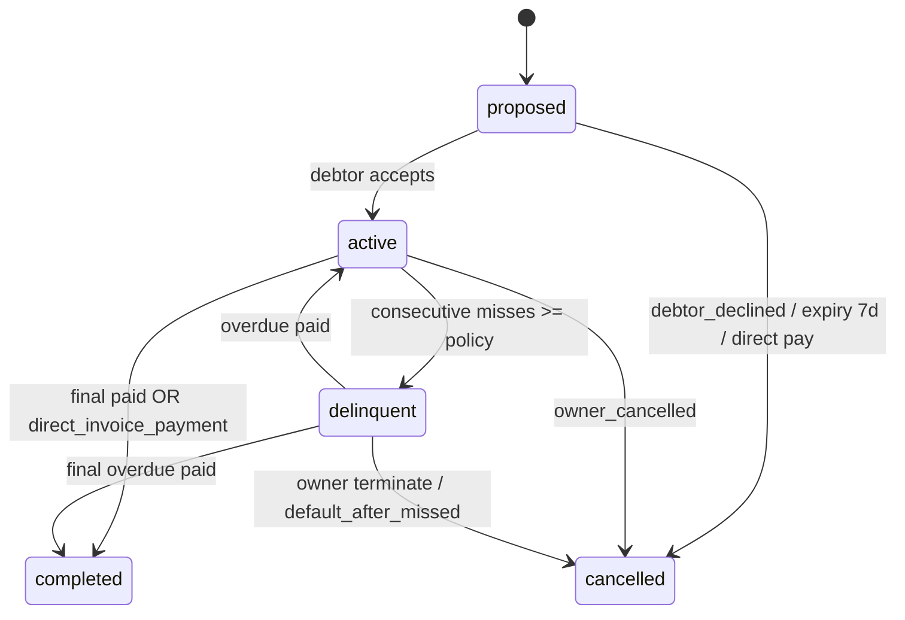

# Overdue — Fixed HLD (2026-09-23)

## What changed vs turn-5 design (+ review round 2)
- Branch precedence locked: `desired>allowed` beats `final<M`; desired>allowed now floor-checks split against M (shrink or no_plan).
- `request_cancelled` replaced by explicit `owner_cancelled` transition (owner-only `PATCH /api/plan-requests/[id]`); debtor withdraw is token-route `POST /api/r/[token]/resolve withdraw`.
- `converted` = debtor accepts proposal + active plan exists only (`PATCH /api/plans/[id] debtor_accept`).
- `count_that_fits_within_Dmax = floor(Dmax/period_days)+1`, weekly 7 / biweekly 14 / monthly 31 conservative + calendar-accurate `lastDueDateExceedsDmax` shrink in proposal API.
- Counter reasons are named enum: `exceeds_allowed_count | final_below_minimum` (not vague boolean).
- Xero = `xero_sync` source in `payments`; Stripe/PayPal = collection. Paddle verified working (billing).
- Stalling fixed: 72h expiry (terminal), 24h resume, max 2 requests / 30d / invoice, one open index.
- Promise/dispute dead ends closed with explicit resume/cancel outcomes; disputes carry `outcome` column (0024).
- Suspended offers on direct payment -> `cancelled(superseded_by_direct_payment)`, not `paid` (reporting hygiene).
- Pre-existing base tables confirmed (not re-created): disputes+promise_missed (0013), promise_date (0010), settlement_offers (0016), sequences/runs (0001) = recovery_sequences/runs alias.
- manual_payment_approvals fields: payment_id PK, created_by, confirmed_by, threshold_cents, created_at.

## Request lifecycle (separate from plan; immutable rows)

## Plan lifecycle

## Money rules
- `payments` source of truth; `paid_cents`/installment status derived + reconciled.
- Manual: amount+currency+date+source+reference+actor required; confirm screen; >threshold needs different confirmer.
- Webhooks: signature verify, `webhook_receipts(provider,event_id)` idempotent, split retry from `outbox_jobs`.
- Settlement <-> plan mutual exclusion via `suspended`, explicit owner choice. Delinquent still blocks settlement until terminated.
- Rung = ladder; Installment = plan. Reminders 09:00, digest 09:15 workspace time. Ownership never zero owners.
