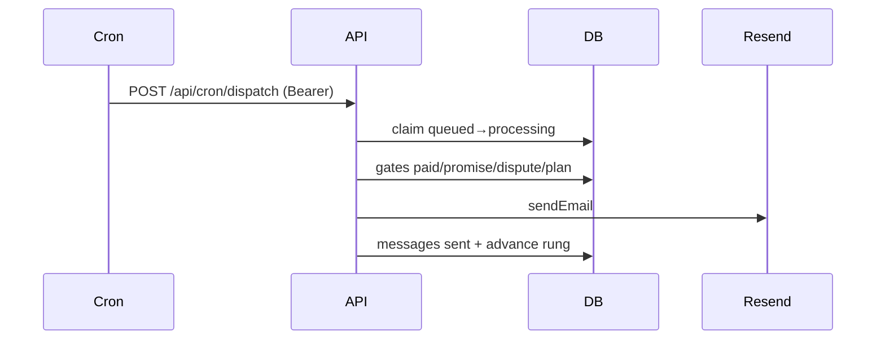
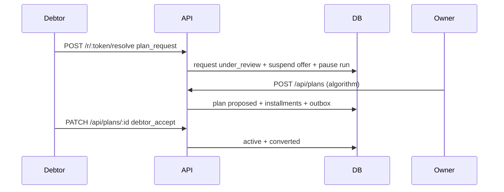

# Overdue — Detailed LLD (codebase-accurate, 2026-09-23)

## 1. Database (0001–0024)

### 1.1 Core ledger
- `profiles(id PK auth.users, email UNIQUE CI, full_name, avatar_url, onboarding_completed, created_at)` RLS SELECT+UPDATE.
- `subscriptions(id, user_id UNIQUE, dodo_*+paddle_*+billing_provider dodo|paddle, product_id, plan free|pro, status active|on_hold|paused|past_due|cancelled|failed|expired (+legacy trialing), current_period_end)` SELECT-only; writes via webhooks/reconcile.
- `integrations(id, user_id, provider stripe|paypal|xero|csv, status connected|error, display_name, last_synced_at, connected_at, provider_account_id, UNIQUE user+provider)`.
- `clients(id, user_id, workspace_id, name, email, billing_email, payment_history_score 0-100, avg_payment_days)`.
- `invoices(id, user_id, workspace_id, client_id, provider stripe|paypal|xero|manual, provider_id, number, status pending|sent|paid|partially_paid|overdue, amount_cents, paid_cents, currency, issue_date, due_date, paid_at, line_item_summary, payment_url, UNIQUE user+provider+provider_id)`. Paid derived from ledger; cached paid_cents reconciled.
- `sequences[id,user_id NULLABLE,workspace_id,name,description,is_active,is_default,is_template,steps JSONB[{step_order,delay_days,tone,ai_enabled,subject_template,body_template}]]` = recovery_sequences alias. Templates `is_template OR user NOT NULL`.
- `runs[id,user_id,workspace_id,sequence_id,invoice_id,current_step(rung),status queued|processing|sent|completed|paused|failed|cancelled*,next_run_at,last_sent_at,messages_sent,attempt,failed_at,error,promise_date/note/amount_cents,reply_classification,last_reply_at,promise_missed,automation_confidence]` = recovery_runs alias. *cancelled via paid.ts (legacy check lacks it but update path uses it). Indexes dispatch(status,next_run_at), one-active partial UNIQUE(invoice) WHERE queued|processing|sent|paused.
- `messages[id,user_id,workspace_id,run_id,invoice_id,to_email,subject,body,step,tone,status sending|sent|failed, sent_at,opened_at,replied,resend_message_id,delivered_at]` + idx(run,step), (resend_id).

### 1.2 Intel / disputes / settlements
- `reply_intel(id,user_id,workspace_id,run_id,invoice_id,classification paid|promise|dispute|question|payment_plan|already_paid|wrong_recipient|angry|needs_human|other,confidence,source heuristic|llm,raw_text,extracted_date,amount_cents,notes)`.
- `disputes(id,user_id,workspace_id,invoice_id,category,amount_cents,reason,status open|resolved,outcome resolved|withdrawn|credit_issued|invoice_corrected (0024),resolved_note,resolved_at)` + open idx.
- `settlement_offers(id,user_id,workspace_id,invoice_id,outstanding_cents,offer_cents,incentive_cents,basis discount|fee_waiver,min_acceptable_cents,max_incentive_bps,fee_basis_confirmed,expires_at,status draft|approved|sent|suspended|accepted|paid|expired|cancelled,suspended_reason,currency,recommend_meta,delivered_at,viewed_at, CHECK offer<=outstanding)` + live idx.
- `settlement_events(id,offer_id,user_id,workspace_id,event recommended|approved|sent|viewed|accepted|promise|plan_request|dispute|expired|paid|cancelled,meta)`.
- `payment_plan_requests(id,user_id,workspace_id,offer_id,invoice_id,requested_cents,preferred_amount_cents,frequency weekly|biweekly|monthly,preferred_start_date,message,status submitted|under_review|converted|closed|expired (+legacy open|accepted|declined),close_reason owner_declined|debtor_withdrew|invoice_paid_directly|owner_cancelled|expired_no_decision,expires_at 72h,decided_at)` + one-open partial UNIQUE(invoice) WHERE submitted|under_review|open.

### 1.3 Plans / money (0022)
- `payment_plan_settings(workspace_id PK,version,min_installment_cents 10000,max_installments 12,max_duration_days 365,max_incentive_bps 500,review_timeout_hours 72,proposal_expiry_days 7,missed_before_delinquent 2,manual_dual_control_threshold_cents 50000,timezone UTC)`.
- `payment_plans(id,workspace_id,user_id,invoice_id,request_id,total_cents,currency,installment_count,frequency,starts_on,anchor_day,status proposed|active|delinquent|completed|cancelled,proposal_version,supersedes_plan_id,policy_snapshot,completion_source final_installment_paid|direct_invoice_payment,cancellation_reason owner_cancelled|debtor_declined|default_after_missed_installments|replaced|invoice_paid_directly,is_counter_proposal,counter_reason exceeds_allowed_count|final_below_minimum (0024))` + idx(invoice,status),(request).
- `plan_installments(id,payment_plan_id,workspace_id,sequence_no,amount_cents,currency,due_date,status scheduled|due|partially_paid|paid|overdue|waived|cancelled,paid_cents,paid_at, UNIQUE plan+seq)`.
- `payments(id,workspace_id,user_id,invoice_id,plan_installment_id,checkout_attempt_id→attempts,amount_cents,currency,source stripe|paypal|xero_sync|manual|bank_transfer,status pending|confirmed|failed|refunded,provider_event_id,recorded_by_member_id,paid_at, UNIQUE source+event)` source of truth.
- `checkout_attempts(id,workspace_id,plan_installment_id,invoice_id,provider stripe|paypal|manual,provider_session_id,url,status open|completed|expired|cancelled,expires_at,regenerated_from_id→self)`.

### 1.4 Workflow / notify / portal (0023)
- `workspaces(id,name,timezone,created_by)`, `workspace_members(id,workspace_id,user_id,role owner|admin|member|viewer, UNIQUE ws+user)`. Permission matrix: view all roles; create/edit/send member+; accept/decline-plan, settlement, manual-pay, cancel/waive owner|admin; team/billing owner. Never zero owners (app rule).
- `workflow_events(id,workspace_id,user_id,invoice_id,plan_id,installment_id,event_type invoice_created|ladder_attached|reminder_sent|resolve_link_created|promise_recorded|promise_missed|promise_amended|plan_requested|plan_proposed|plan_accepted|plan_declined|plan_countered|installment_due|installment_paid|installment_missed|plan_delinquent|plan_completed|plan_cancelled|settlement_suspended|settlement_resumed|dispute_opened|dispute_resolved|invoice_paid|manual_payment_recorded|portal_link_renewed|ownership_transferred,actor_type system|owner|debtor|provider,payload)` SELECT+INSERT only + `reject_workflow_mutation` trigger.
- `notifications(id,workspace_id,recipient_member_id→members,type,entity_type,entity_id,dedupe_key,channel in_app|email,read_at,sent_at, UNIQUE ws+dedupe)` keys: reminder run+step, installment id+stage, proposal request+version, receipt payment_id, digest ws+date.
- `debtor_portal_sessions(id,workspace_id,invoice_id NOT NULL,plan_id NULL,token_hash sha256,issued_to_email,expires_at 30d,revoked_at,last_used_at,issued_reason resolve_link|fresh_link|plan_portal|renewal)`.
- `webhook_receipts(provider,provider_event_id PK,signature_valid,payload_hash,received_at,processed_at,attempt_count)`; `webhook_events(provider,event_id UNIQUE,payload,processed_at)` legacy idempotency.
- `outbox_jobs(id,event_id→workflow,job_type email|webhook_retry|reminder|digest,payload,run_after,attempt_count,last_error,dead_lettered_at)` + run_after idx.
- `manual_payment_approvals(payment_id PK→payments,created_by,confirmed_by,threshold_cents,created_at)`.
- `integration_credentials(id,user_id,provider,vault_secret_id,payload)` RLS deny-all + Vault RPC; `ai_usage(user_id,month PK,count)`; `webhook_events` locked.

RLS: 0019 authenticated SELECT-only (+profiles UPDATE); all writes service_role + `getOwnedRecord`. 0020 `assert_write_boundary()`.

## 2. Algorithm + dates (`payment-plan.ts`, `money-rules.ts`)

```
T>0,P>0,P>=M else no_plan; P>=T→direct.
allowed=min(Cmax,floor(Dmax/period)+1), period 7/14/31-conservative.
desired=ceil(T/P); final=T-P*(desired-1).
Branch1 desired>allowed: for n=allowed..2 if min(splitEvenly(T,n))>=M → counter(n,exceeds?,reason=exceeds_allowed_count); else no_plan.
Branch2 final<M: n=desired-1; n<2→no_plan else counter(splitEvenly,reason=final_below_minimum).
Branch3: (n-1)×P+final, counterReason=null.
Ex 114000/30000/10000→[30000×3,24000]; 120000/30000→4×30000.
```
`lastDueDateExceedsDmax(start,freq,count,Dmax)` calendar check; proposal API shrinks until fits. `buildDueDates`: weekly +7, biweekly +14, monthly anchor_day (Jan31→Feb28→Mar31), date-only + tz label. `money-rules`: canCreateSettlement null/completed/cancelled; canActivatePlan paid/expired/cancelled; dualControl amount>threshold→creator≠confirmer; directPaymentOfferEndState live→paid/suspended→cancelled; dispute outcome guard.

## 3. State machines

- runs: queued→processing→sent/queued (advance) / paused (promise-hold/dispute/plan/human/bounce/no-email) / completed (paid/steps-exhausted) / failed (cap/no-email) / cancelled (paid/dispute-credit). current_step=rung.
- settlement_offers: draft→approved→sent→accepted→paid (via offer) | suspended (plan open/proposed) →sent (request closed) or cancelled (direct pay superseded) | expired | cancelled.
- payment_plan_requests: submitted→under_review→converted (debtor_accept+active only) / closed (owner_declined/owner_cancelled/debtor_withdrew-token/invoice_paid_directly) / expired 72h terminal (new row at [*]).
- payment_plans: proposed→active (debtor_accept) →delinquent (misses≥policy) →active (paid) / completed (final or direct_invoice_payment) / cancelled (debtor_declined/owner_cancelled/default/replaced). Immutable versions via supersedes_plan_id.
- installments: scheduled→due→partially_paid→paid / overdue→paid / waived / cancelled. Derived from payments sum; cached paid_cents reconciled.
- disputes: open→resolved + outcome; promise: queued hold→missed (promise_missed + resume +24h).
- checkout: open→completed/expired/cancelled + regenerated_from chain; payments pending→confirmed/failed/refunded; notifications unread→read/sent; outbox pending→sent/dead-letter.

## 4. API contracts (auth/validation/effects)

Owner (`requireUser`+rateLimit+getOwnedRecord): plans POST (requestId/total/preferred/freq/startsOn; suspends settlement; versioned insert; calendar shrink; workflow+outbox) / plans/[id] PATCH accept|decline|cancel / plan-requests/[id] PATCH decline|cancel (resume +24h, unsuspend, workflow+outbox) / disputes/[id] PATCH outcome (+outcome column; resume or cancel) / payments/manual POST (amount/source/reference/confirm + dual-control → payments + approvals + workflow) / portal/renew POST (hashed 30d session + workflow) / invoices POST/PATCH/send / settlements recommend(RO)/approve (offer≤outstanding, bps≤2000, expiry≤14d, supersede-cancel, token link) / clients/sequences CRUD / billing status/checkout / integrations OAuth+sync / account sender/export/delete / ai-draft/tools/health. Debtor (token, no login): resolve accept/promise(≤60d)/plan_request(2-per-30d,72h)/dispute/withdraw + pay fail-closed. Cron (Bearer): dispatch. Webhooks (per-provider sig + webhook_events dedupe → markInvoicePaid/reconcile or subscription upsert).

Errors: 400 validation, 404 invalid token/not-found, 409 race, 410 expired, 422 no_plan/confirm/dual-control, 429 rate-limit, 500 missing service_role / own-write fail (retry), 503 save fail.

## 5. UI mapping

InvoiceTable←getInvoicesWithMeta→PATCH invoices (pause/resume/paid). InvoiceRecoveryFlow←getInvoiceDetail live offer→SettlementCard→POST send. RecoveryTimeline←buildInvoiceTimeline (pure). RecoveryQueue/UrgencyQueue←getRecoveryQueue/getUrgencyQueue→?focus=. EscalationLadder/TonePill←SequenceEditor↔PUT sequences. SettlementCard←recommend/approve. SettlementStrip (RSC live offers + promise buckets). ResolutionView←r/[token] offer→resolve/pay (P/frequency/start + disclosure + withdraw/dispute). TopBar/Dock/PageHeader shell. PlanManager←billing reconcile + checkout. IntegrationsManager←sync/disconnect/CSV/PayPal. ConnectSourcesDialog/AccountDataControls (export/delete). AppToolDetail/RealtimeCalculator (browser math). SmartCsvImporter→map/insights→csv import. Marketing/Auth/UI presentational + AuthForm OTP/OAuth.

## 6. Sequences (mermaid)




## 7. Ops

Timing: reminders 09:00, digest 09:15 ws time; review 72h, proposal 7d, resume +24h, promise ≤60d, settlement ≤14d, portal 30d. Scripts: launch-check (env + 0001–0024 + dispatch.yml), verify-gates (test/type/lint/build/audit), assert-write-boundary, tenant-precheck, sql-rollback-drill + rollback/, dodo-e2e (manual), probe-computes. Tests: 32 files/238 pass — payment-plan (7), money-rules (8), paid-webhooks idempotency, dispatch/inbound, settlement, token, csv, billing, reply/draft/promise/quota, ownership. Paddle live-tested primary; Dodo fallback; Stripe secret present, PayPal/Xero empty (manual+Stripe scope).

## 8. Launch-blocker fixes (0025 + guards)

- Auth: getOwnedRecord = tenancy (user_id). requireWorkspaceRole = authorization (workspace_members role). Enforced admin+ on plans, plan-requests, disputes, manual payments, settlements/approve; owner on team invite/transfer. Null workspace → owner fallback (single-user compat). Tests in workspace-guard.test.ts.
- runs.status now includes cancelled (0004 lacked it, paid.ts wrote it) — fixed in 0025.
- Webhooks: webhook_events canonical dedupe; webhook_receipts observability only (dual-written in recordEvent, never gates). All 7 handlers use alreadyHandled/recordEvent.
- Legacy: payment_plan_requests open|accepted|declined backfilled in 0021+0025; gates accept submitted|under_review|open. subscriptions.trialing intentional (entitlement grants active|trialing → pro).
- Settlement direct-pay: live approved|sent|accepted → paid; suspended → cancelled(superseded_by_direct_payment). Explicit decision: paid counts settlement-channel recovery; suspended was parked, so cancelled preserves conversion signal. Test directPaymentOfferEndState.
- Team: POST /api/workspaces/members (owner invite → workspace_invites), POST+PATCH /api/workspaces/transfer (owner-initiated, admin-accepted, workflow event). prevent_zero_owners trigger backs never-zero-owners.
- Cron: dispatch writes cron_heartbeats every tick; GET /api/cron/health degraded when no success in 2h — attach external monitor.
- PayPal/Xero: UI already gates unconfigured OAuth (message), blurbs now state live-credentials required. PayPal per-workspace creds; webhooks fail closed without PAYPAL_*/XERO_* (no live creds configured — manual+Stripe scope for launch).
- Email: renderEscalationEmail (ladder) + renderPlanEmail(kind proposal|accepted|due|overdue|receipt|revision|cancellation|fresh_link, portalUrl, disclosure).

## 9. Living items closed (post-review)

- PayPal manual-verify visibility: sync-observed paid flips now write payments ledger (source paypal|stripe|xero_sync) + reconcilePaidWork (stops runs/disputes/offers/plans + workflow invoice_paid). Owner sees paid badge (provider column) + timeline event with source, not a silent flip. Webhook path unchanged (real-time); sync covers missing/delayed webhooks. See sync.ts paidFlips.
- Null-workspace fallback expiry: tracked via `npm run db:backfill-check` (scripts/check-workspace-backfill.sql) weekly until all zeros ×2 weeks, then hard-fail + NOT NULL. TODO marker in workspace-guard.ts. Fallback only fires after getOwnedRecord proves ownership — never a stranger grant (tested).
